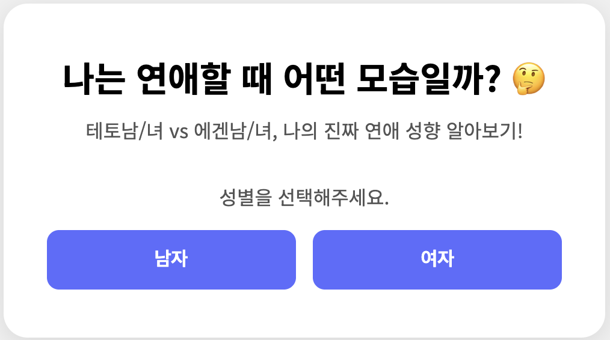

# 연애 성향 테스트: 나는 테토일까, 에겐일까? 🤔

요즘 유행하는 '테토남/녀'와 '에겐남/녀'의 개념을 바탕으로 나의 연애 스타일을 분석해 보는 심리테스트 웹앱입니다. 10개의 간단한 질문을 통해 관계 속 나의 모습을 발견해 보세요.

**🔗 지금 바로 테스트 해보기: [https://toydevlab.github.io/TetoOrAegen/](https://toydevlab.github.io/TetoOrAegen/)**


---

## 💻 미리보기 (Preview)




---

## ✨ 주요 기능 (Features)

* **성별 선택 기능**: 결과의 몰입감을 높이기 위해 성별에 따라 다른 결과(테토남/녀, 에겐남/녀)를 제공합니다.
* **10문항 심리 테스트**: 연애, 데이트, 관계에 관련된 10개의 질문을 통해 성향을 분석합니다.
* **상세 결과 분석**: 단순한 타입 설명이 아닌, 아래 내용을 포함한 깊이 있는 분석 결과를 제공합니다.
    * 연애 가치관 분석
    * 관계에서의 강점 및 성장 포인트
    * 다른 타입과의 '환상의 케미' & '환장의 케미' 분석
* **결과 공유 기능**: 테스트 결과를 친구나 연인과 공유할 수 있도록 링크 복사 기능을 제공합니다.
* **반응형 디자인**: 모바일, 태블릿, 데스크톱 등 모든 기기에서 최적화된 화면으로 즐길 수 있습니다.

---

## 🛠️ 기술 스택 (Tech Stack)

* **HTML5**
* **CSS3**
* **JavaScript (ES6+)**

백엔드나 별도의 프레임워크 없이 순수 바닐라 JS로 모든 로직을 구현했습니다.

---

## 🚀 로컬에서 실행하는 법 (How to Run Locally)

1.  이 저장소를 클론합니다.
    ```bash
    git clone [https://github.com/toydevlab/TetoOrAegen.git](https://github.com/toydevlab/TetoOrAegen.git)
    ```
2.  프로젝트 폴더로 이동합니다.
    ```bash
    cd TetoOrAegen
    ```
3.  `index.html` 파일을 브라우저에서 엽니다.

---

## 🙏 특별 감사 (Special Thanks)

이 프로젝트는 **Google의 생성형 AI, Gemini**의 도움을 받아 제작되었습니다.

프로젝트 초기 아이디어 기획부터 시작하여, JavaScript 코드 구조화 및 리팩토링, 테스트 질문 및 결과 설명 콘텐츠 생성, 그리고 이 README 파일 작성에 이르기까지 프로젝트의 여러 단계에서 Gemini가 제공하는 창의적인 제안과 기술적인 도움을 적극적으로 활용했습니다.

---

## 📜 라이선스 (License)

이 프로젝트는 [MIT License](LICENSE)를 따릅니다.